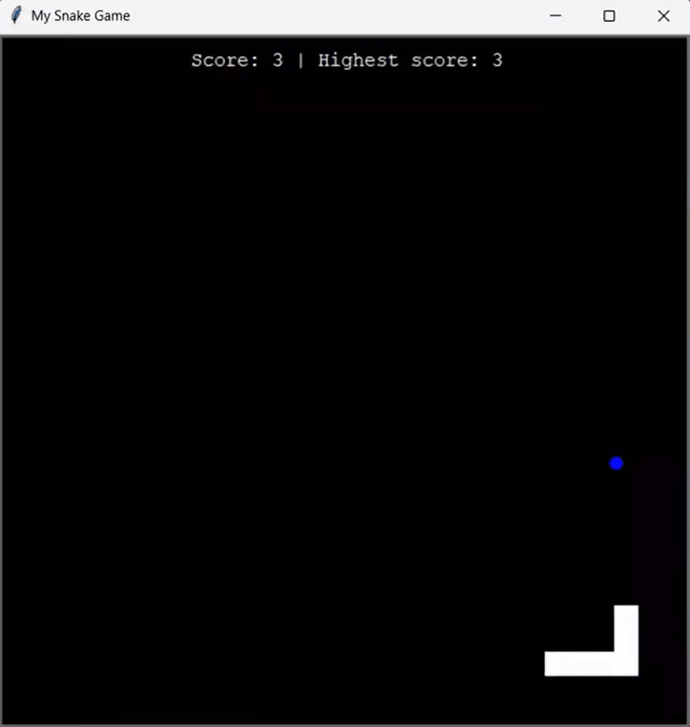

# 🐍 Snake Game (OOP Edition)
A classic Snake game built with Python's turtle module, emphasizing Object-Oriented Programming (OOP) and File I/O for high-score persistence.

## 🚀 Features
**Dynamic Movement:** Smooth snake movement using segment-following logic.

**Collision Detection:** Intelligent tracking for wall hits, self-collision (tail), and food consumption.

**Persistent High Score:** Saves your best score to a score_record.txt file, so your record remains even after closing the game.

**Responsive Controls:** Non-reversing directional logic (the snake cannot turn 180° into itself).

## 🛠 Project Structure
The code is organized into three main logical components:

1. **Snake Class:** Manages the body segments, directional constraints, and growth logic.

2. **Food Class:** A specialized turtle that relocates to random coordinates when eaten.

3. **Score Class:** Handles the UI display and manages the File I/O logic to read/write the historical high score.

## 🎮 How to Play
Run the script:

```Bash
cd Day20
python main.py
```
Controls: Use your keyboard arrow keys:

- **Up Arrow:** Move Up

- **Down Arrow:** Move Down

- **Left Arrow:** Move Left

- **Right Arrow:** Move Right

## 📝 Technical Highlights
The game uses a robust error-handling block to manage the high score file:

```Python
try:
    with open("score_record.txt", mode="r") as f:
        content = f.read().strip().split()
        if content:
            self.highest = int(content[-1])
except FileNotFoundError:
    self.highest = 0
```
This ensures the game doesn't crash if the file is missing or empty on the first run.

**Screen Tracer Logic**

By using ```screen.tracer(0)``` and ```screen.update()```, the game eliminates the "stuttering" effect of the turtle drawing each segment individually, resulting in a buttery-smooth 60FPS feel.

## 👌🏼 Example Interaction
